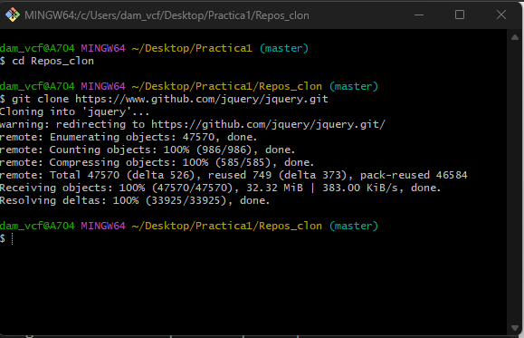
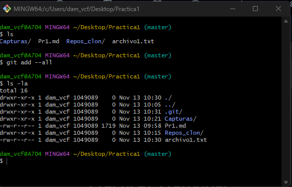
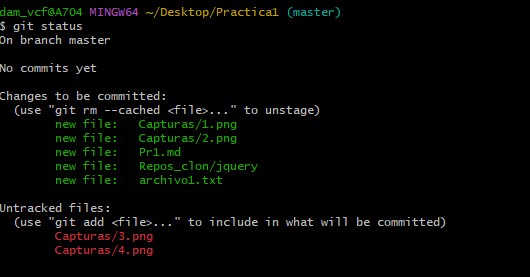

#    Practica 1 GIT: Inicio 
Para el correcto desarrollo de esta práctica se debe rellenar sobre esta plantilla el desarrollo de cada pregunta con capturas sobre el comando realizado y evidencias.

También se deberá entregar el link al repositorio.
###  Clonar repositorio externo
###  Creación de repositorio local
######   Antonio Coloma - 2020

## 1.-Clonar repositorio externo

1. En un terminal posicionaros donde se creará el directorio del proyecto.
2. Clonad el proyecto de la libreria Jquery que lo mantiene en github.
* https://www.github.com/jquery/jquery.git
3. Entrad en el directorio creado (jquery) y mostrad un log de los estados por los que ha pasado el proyecto.

## 2.-Crear un repositorio local

1. Cread un directorio donde vamos a empezar el proyecto y acceder a él.

2. Inicializad el repositorio 
3. Cread un primer archivo "archivo1.txt"

4. Visualizad el estado del proyecto

5. Pasad el archivo del espacio de trabajo a la zona de preparación.

6. Visualizad de nuevo el estado del proyecto

7. Realizad el primer commit y visualizad de nuevo el estado del proyecto.

8. Cread dos archivos más al proyecto. "archivo2.txt" y "archivo3.txt"

9. Pasad el segundo archivo a la zona de preparación.

10. Haced Segundo commit del proyecto.

11. Añadid el ultimo archivo a la zona de preparación y realizad el commit.

12. Mostrad el log de todos los cambios.

13. Cambiad el archivo "archivo1.txt" y verificad el estado de git.

14. Pasad el archivo a la zona de preparación.

15. Modificad los archivos 2 y 3 del proyecto. Verificad estado del git.

16. Pasad los archivos 2 y 3 a la zona de preparación.

17. Realizar el commit de los cambios realizados.

18. Mostrad el log de todos los cambios.

https://github.com/Franxu16/Practica1_FranVidal.git

